433MHz ground plane antenna
==============================

Cut about 3cm of copper or brass tube of suitable diameter (i used 4mm outer and 3.5mm inner diameter which fits RG174 coax) and 5 pieces of 1mm brass wire (20cm in length).

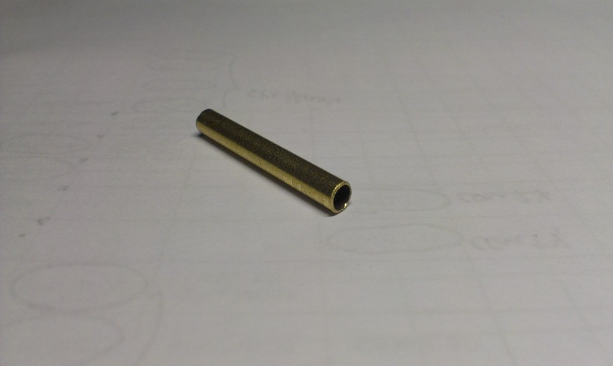

Prepare some wooden (or other non-thermoplastic material) tools to keep the parts together. Align radials to end in the middle of the tube.

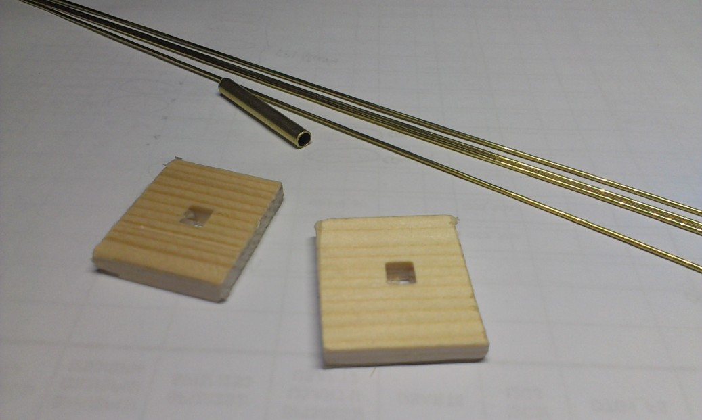
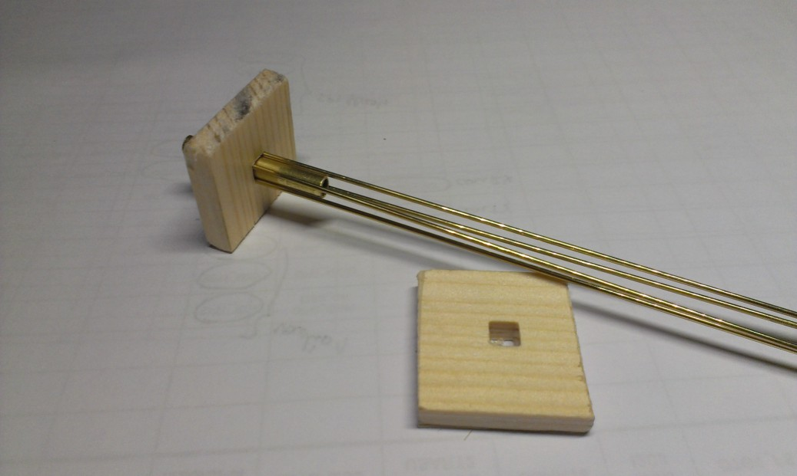
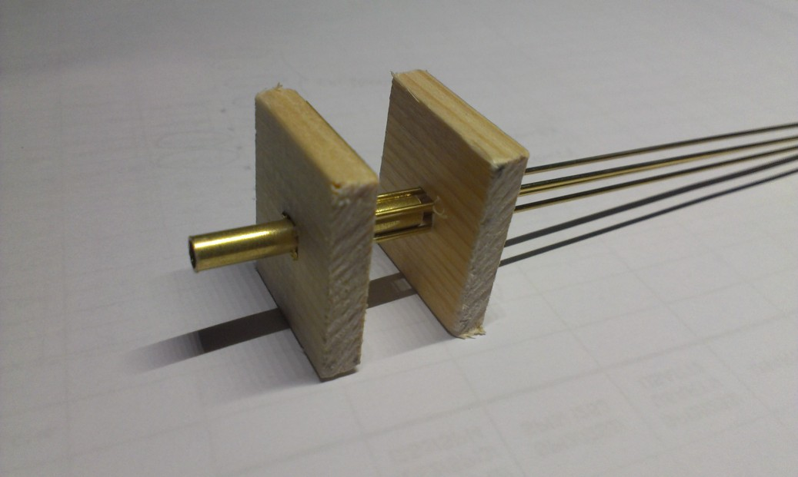
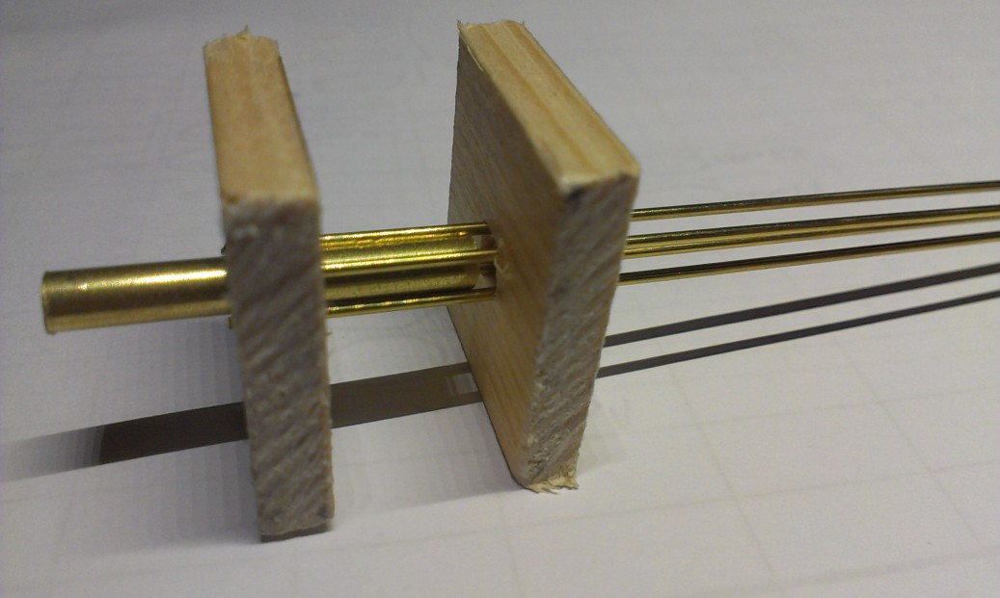
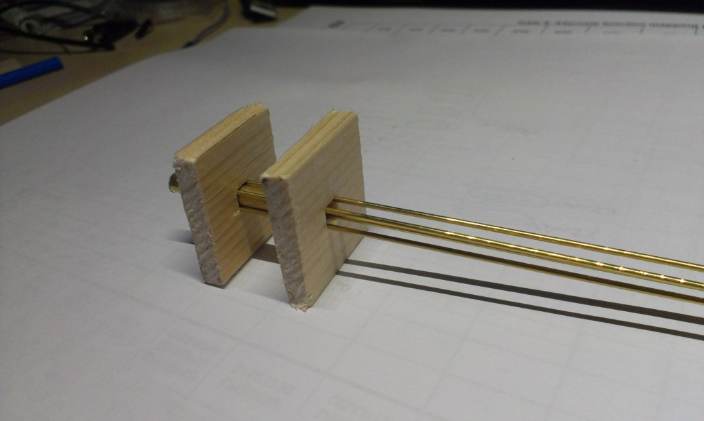

Solder all 4 radials with generous amount of flux.

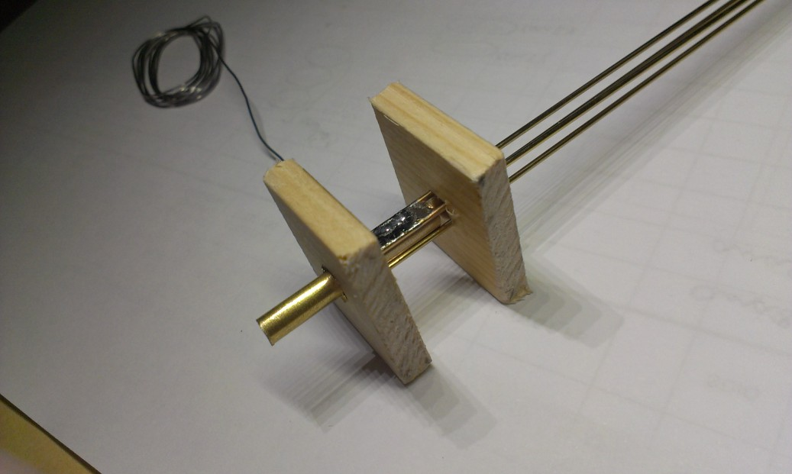
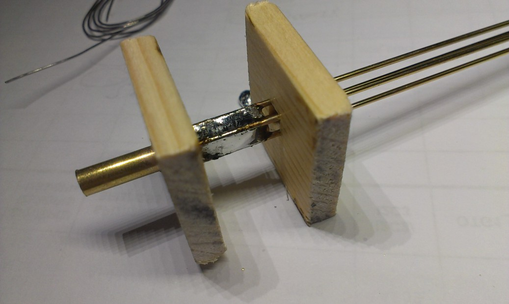

Now you can safely remove wooden helpers.

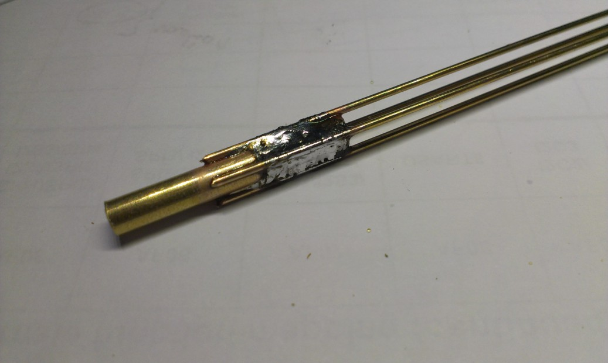

Remove about 1cm of coax insulation (RG174) and fold the shielding screen back. Remove insulation from coax center wire. First tin both coax center wire and 5th piece of brass wire and solder them together. Cover the joint and at least 5cm of center brass wire with heat shrink tube.

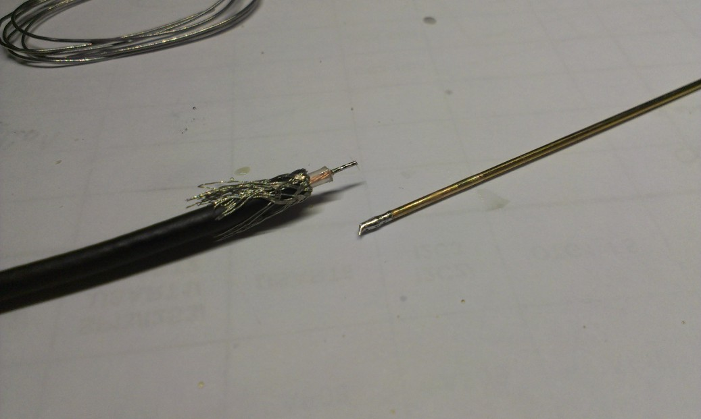
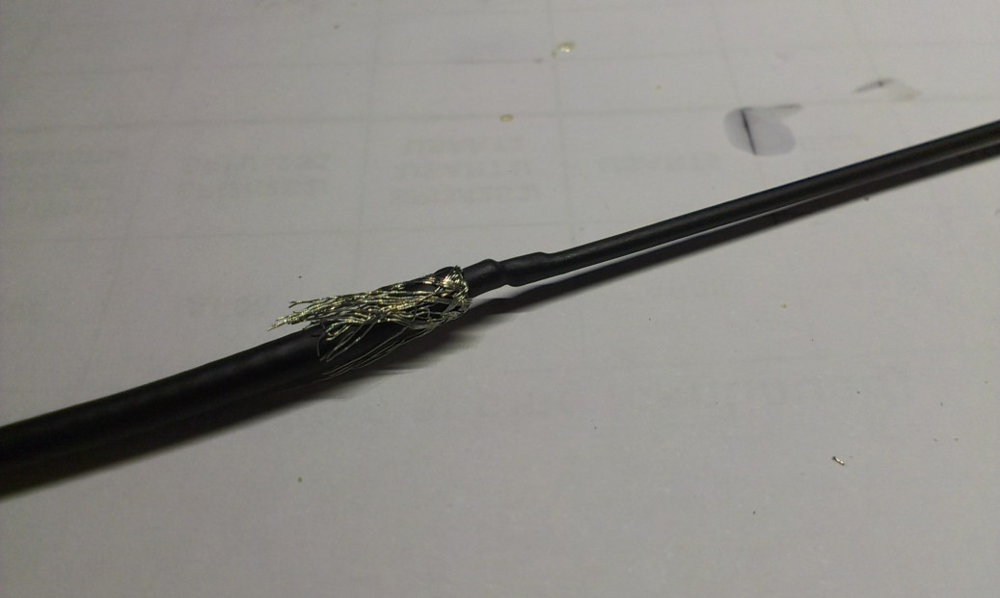

Now you can tin the end of the brass/copper tube and insert the coax inside. Solder coax shield to the tube. Optionally you can crimp the tube to fasten the coax inside (use hexagonal crimping tool used for coaxial connectors).

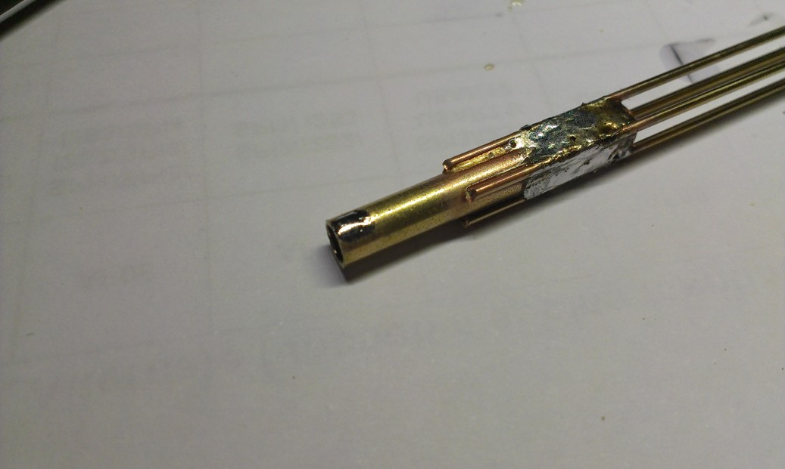
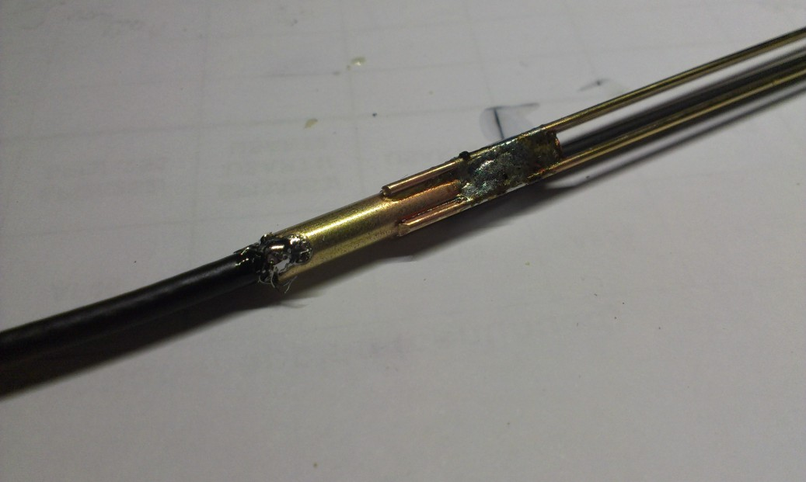

Cover the brass tube with heat shrink tube.

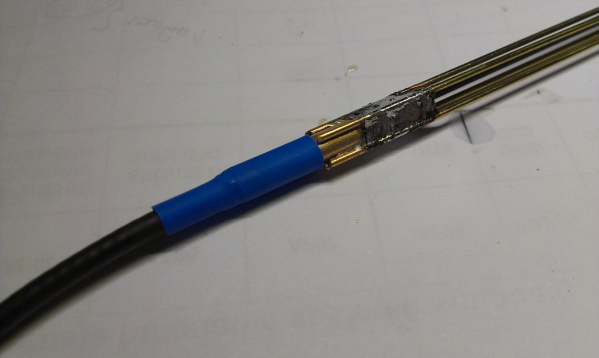
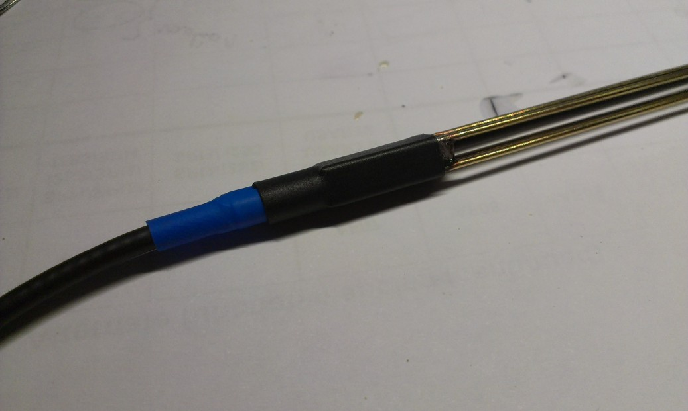

Bend the radials to desired angle and apply some glue around the center wire to prevent water entering inside. Then cut radials and center wire to 164mm length.

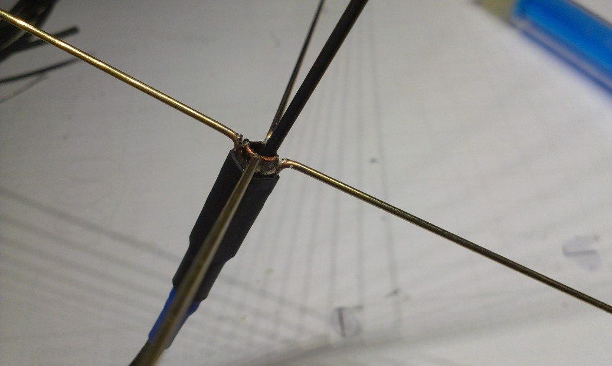

