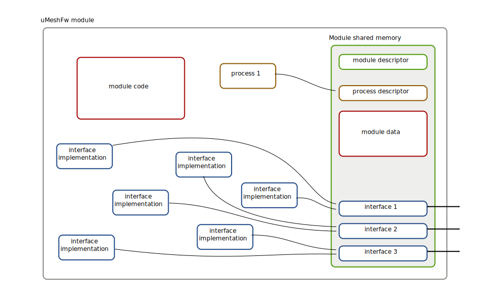

uMeshFw Hardware Abstraction Layer (HAL)
==============================================

Introduction
--------------------------

Despite its name, Hardware abstraction layer is also responsible for many
other tasks besides hardware abstraction. It defines how the uMeshFw parts
are split, how do they communicate together, how are the processes managed,
how do they share common memory, etc. HAL is one of the most important
parts of the uMeshFw because it allows the system to scale without much
complications.

Architecture overview
---------------------------

### uMesh protocol stack

### External libraries

uMeshFw uses some external libraries included as git submodules. They are placed
in the lib subdirectory.

### platform-specific code

Each supported platform have its own platform/name directory with following contents:

  * port.c/port.h - platform specific initialization and configuration
  * FreeRTOSConfig.h - FreeRTOS configuration for this platform
  * platform linker script
  * platform SConscript file with build configuration

### uMeshFw modules

Large part of uMeshFw code is implemented as modules which use strictly defined
interfaces to communicate between each other. This allows the system to be more
scalable and maintanable.

### uMeshFw interfaces

All interfaces available to be used for intermodule communication are placed
in the hal/interfaces directory.

### command-line interface implementation

CLI is implemented as a module. However, because of high CLI complexity, all CLI
logic is implemented outside the CLI module with its own structure.

Modules & interfaces & processes
--------------------------------

uMeshFw modules are used to logically split different parts of the uMeshFw
firmware into self-contained groups. Each module may contain:

  * module API. It is used to create and initialize module instances,
    initialize all processes and module interfaces. Usually, module initializer
    accepts a module instance name as a parameter. Other parameters may be added
    if they are required at the time of initialization.

  * module interfaces. Each module can expose multiple different interfaces
    which are initialized in the module initializer. Each interface is then
    connected to functions inside the module implementing the required
    interface functionality.

  * module processes. If a module needs a "service process" (ie. a long-lived
    process which handles all module logic), it can create a process descriptor
    and publish it. Global uMeshFw process manager will then manage this process.
    Process will be started/stopped, respawned (in case of an error, stack overflow,
    failed allocation, etc) automatically.

Interprocess communication
------------------------------

Memory protection
-----------------------

