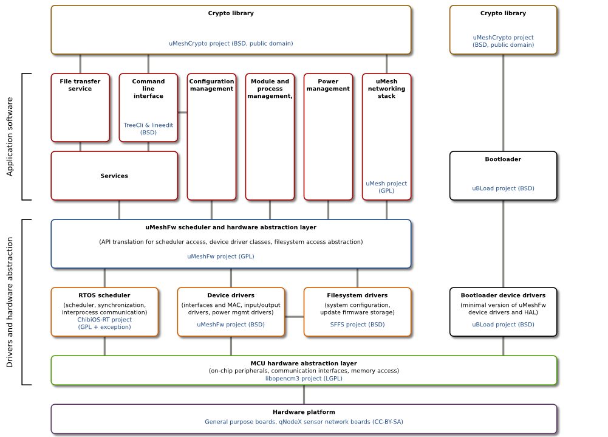

uMesh secure network node firmware
======================================

uMesh node firmware combines many different projects and modules together with
uMesh network protocol stack to create a solid platform for building wireless
mesh nodes using various kinds of hardware and architectures.

Firmware components - external dependencies
--------------------------------------------

  * [SimpleFlashFileSystem](/embedded/sffs) -
    Simple filesystem originally developed for saving configuration and firmware
    update images on NOR flash memories in embedded systems. It is based on
    other similar filesystems (like yaffs, jffs), but it is made even simpler.
    No filenames or directory structure is supported, files are referenced by
    their IDs (like on smart cards). Filesystem is optimized for simplicity
    and is probably unoptimal in every single way.

  * [LineEdit library](/embedded/lineedit) -
    Lineedit aims to be a lightweight command line editor usable over common stream
    interfaces (like sockets, serial ports, etc.). It was written to be used on an
    embedded platform and its features and code are optimized for embedded environments.

  * [TreeCli - a hierarchical, tree structured command line parser/interface](/embedded/treecli) -
    Treecli provides a convenient way to configure various embedded devices using
    common serial and network interfaces. It is inspired by command line interfaces
    commonly found in network gear (switches, routers, firewalls..).

  * [qBoot bootloader](/embedded/qboot) -
    Simple bootloader capable of doing firmware updates on request from external flash
    memories or over locally connected interfaces (USART Xmodem, USB DFU). It also
    checks firmware integrity on boot and resolves possible unbootable situations
    by loading last known working firmware and configuration.

  * RTOS kernel - provides en environment to run all required threads and standard
    tools for thread synchronization and interprocess communication.

Firmware components - internal (uMeshFw repository)
-----------------------------------------------------

  * [uMesh network protocol stack](/embedded/umesh) - uMesh is a set of experimental communication protocols
    intended mainly for low data rate wireless mesh networks such as sensor networks for
    environmental data gathering, asset and people tracking, short message delivery and
    paging, narrowband voice communication etc. in scenarios, where common network
    infrastructure is not reachable and/or is not feasible for particular purpose.
    Protocols are designed with high level of security in mind which could make them
    suitable for many critical and disaster recovery applications in the future.

  * [HAL (Hardware Abstraction Layer)](hal) - this is the main part responsible for
    communication between all other modules. All devices and services in an
    uMeshFw provide an API with common characteristics. This module also maintains
    a list of all available (registered) devices and services which can be used
    to dynamically locate them at runtime. There is a [list of HAL classes](hal/classes.md)
    and [list of device drivers](hal/drivers.md).

  * Command line interface - it builds on TreeCli and LineEdit libraries and adds
    uMeshFw specific functionality and the whole system configuration tree structure.
    System can be configured executing commands and setting variables on different
    nodes responsible for configuring every system component. This is a standalone
    component which can be freely removed from uMeshFw if its functionality is not
    required. Note that initial configuration must be done differently in this case.

  * Low level device drivers - drivers for various hardware devices usually present
    directly on the uMeshFw MCU. These drivers usually just maps HAL API to
    underlying RTOS HAL API or manufacturer specific libraries.

  * High level device drivers - these drivers build on low level drivers and add
    another level of abstraction (power monitoring and management drivers, network
    interface drivers, memory device drivers, virtual terminal drivers, etc.).
    Implementation of these drivers is not dependent on hardware platform.

  * application specific protocols - besides routing data, uMeshFw can be accessed
    directly for the purpose of node configuration, onboard sensor reading, firmware
    update, etc. There is a suite of simple protocols which allow this functionality.
    This is a standalone component which can be freely removed from uMeshFw if its
    functionality is not required.

Firmware architecture
-------------------------

Supported hardware
----------------------

The node firmware is meant to be run on small SBC/SoC platforms with following requirements:

- at least 16KB of RAM is needed to store tables (routing, neighbors, route discovery, node auth) and cryptographic material. 64KB of RAM is needed to run full-featured node firmware.
- 128KB of program memory
- at least 24 MIPS of computing power to enable the network to converge in reasonable time (crypto operations are computationally expensive)

There are several platforms out there which can be used. Practically any Cortex-M3/M4 controller with enough memory is usable. Radio transceiver should support GMSK modulation with BT=0.5 and datarates of at least 20kbps, although umesh stack is not radio/frequency/modulation dependent.

There is a [generic hardware platform page](platforms) describing how uMeshFw compatible platforms are made, which hardware components are essential for normal operation, how a new platform can be made or how to port uMeshFw to an existing platform. It also contains [list of already supported hardware platforms](platforms/supported.md) and [list of supported radio transceivers](platforms/radio.md).

Source code repositories, download and how to contribute
-----------------------------------------------------------

All sources are made available using GNU GPLv3 license and everyone is free to modify them under this license. They are available on Github and on this location as tarballs. More information can be found [here](sources.md).

Community support
---------------------------------

TODO:

